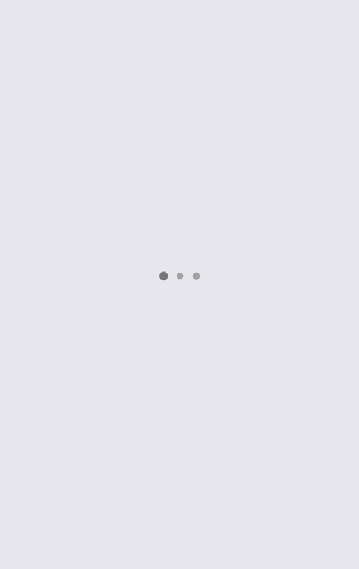

# react-native-three-dots-loader

Simple three dots loader for react native without any warning

This component did not use any external libs, fixed common issue, like key, useNativeDriver

## Installation

`yarn add giant.panda_react-native-three-dots-loader`

## Usage



`import Loader from 'giant.panda_react-native-three-dots-loader'`

...

```
return (
  <Loader>
)
```

## Props

| Prop              | Description              |
| :---------------- | :----------------------- |
| size              | Dot size                 |
| background        | Dot background           |
| activeBackground  | Active dot background    |
| dotMargin         | Dots horizontal margin   |
| animationDuration | Scale animation duration |
| animationScale    | Maximum scale            |
